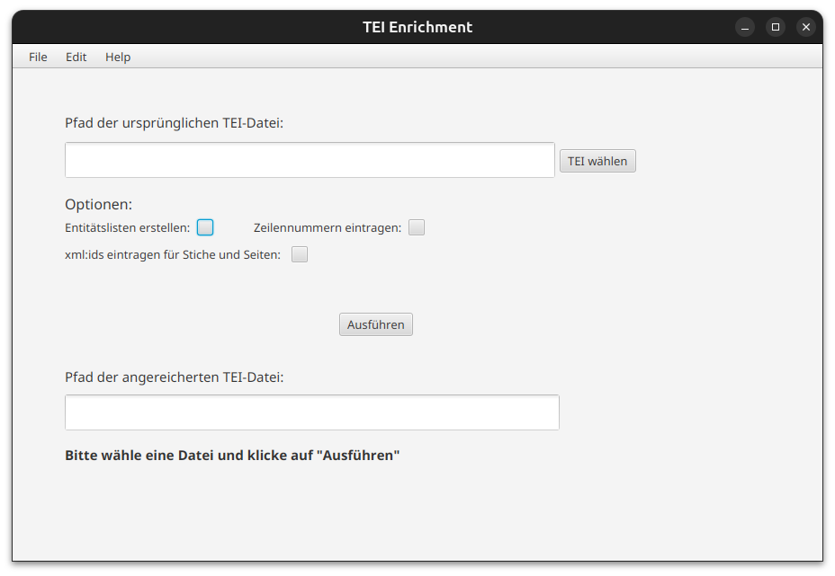

Copyright (c) 2024 Universität Trier\
Permission is hereby granted, free of charge, to any person obtaining
This program is free software: you can redistribute it and/or modify
it under the terms of the GNU General Public License as published by
the Free Software Foundation, either version 3 of the License, or
(at your option) any later version.

This program is distributed in the hope that it will be useful,
but WITHOUT ANY WARRANTY; without even the implied warranty of
MERCHANTABILITY or FITNESS FOR A PARTICULAR PURPOSE.  See the
GNU General Public License for more details.

You should have received a copy of the GNU General Public License
along with this program.  If not, see <http://www.gnu.org/licenses/>.

## Anreichern einer verschlagworteten TEI-Datei mit Zusatzinformationen in Form von Entitätslisten, Zeilennummerierung und dem Einfügen von xml:ids für Kupferstiche, Seiten und Artikel

Mit dieser JavaFX-Applikation ist es möglich über eine FileChooser eine TEI-Datei auszuwählen, die bereits mit Elementen der Form z.B. ```<name ref="https://d-nb.info/gnd/4229460-5">Schlagwort</name>``` verschlagwortet wurde. Je nach Auswahl der Optionen der grafischen Benutzeroberfläche werden daraufhin Entitätenlisten erstellt, Zeilen automatisch nummeriert und/oder `xml:id`s für Artikel, Stiche und Seiten eingetragen.



## Ausführung

Voraussetzungen:\
Voraussetzungen für die Ausführung des Programmes sind ein installiertes Java JDK und 
Apache Maven.\

Nötige Angaben:\
Um das Programm ausführen zu können, muss eine TEI-konforme Datei gewählt werden. 
In dieser TEI-Datei muss im übergeordneten ```<TEI>```-Element eine ```xml:id``` der Form ```band_***``` existieren. Zusätzlich dazu muss im ```<title>```-Element das Attribut ```ref="band_***"``` gesetzt sein. Der Wert des Attributes bestimmt die ```xml:id```s, die vom Programm erstellt werden.\
Um die Option `Entitätslisten erstellen` ausführen zu können, müssen sich die `merian_entitites_*.xml`-Listen im selben Ordner wie die gewählte TEI-Datei befinden.

Für Linuxsysteme:\
Da die JavaFX-Applikation von Maven gebaut wird, sieht der Befehl zum Starten über die Bash wie folgt aus:\
`mvn clean javafx:run`\
Dieser Befehl muss vom Ordner aus gestartet werden, in dem sich die `pom.xml`-Datei von Maven befindet.\
Alternativ dazu kann das Bash-Skript `startEnrichment.sh` ausgeführt werden, dass die grafische Benutzeroberfläche startet.

Für Windows:\
Zur Ausführung des Programmes kann die Datei `tei_enrichment.bat` ausgeführt werden. Dadurch wird die grafische Benutzeroberfläche gestartet.

Die Grafische Benutzeroberfläche selbst besteht aus einem Button `TEI wählen` über den die entsprechende TEI gewählt werden kann. Anschließend können verschiedene Optionen mit einer Checkbox ausgewählt werden: `Entitätslisten erstellen`, `Zeilennummern eintragen` und `xml:ids eintragen für Stiche und Seiten`. Es können dabei auch mehrere Optionen gleichzeit ausgewählt sein.\
Um das Programm auszuführen kann anschließend auf den `Ausführen`-Button gedrückt werden. Nach der Ausführung gibt das Programm im unteren Bereich der Benutzeroberfläche Rückmeldung in Form von Text. Über diesem Text befindet sich ein Fenster, in dem der absolute Pfad zu sehen ist, in dem die angereichterte TEI zu finden ist. In dem Ordner des Pfades mit der TEI befinden sich nach der Ausführung die angereicherten Entitäslisten, sofern diese Option vorher ausgewählt wurde.\
Die erzeugten Entitätslisten können nach der Ausführung umbenannt und verändert werden (z.B. das `title`-Element), der Dateiname muss allerdings vor der Ausführung die bei "Voraussetzungen" angebene Namenskonvention einhalten.

## Ordnerstruktur

**tei_enrichment**  
Enthält die `pom.xml` für Maven und eine `.bat`-Datei zum Ausführen des Programmes unter Windows.

**tei_enrichment/source/main/resources/schemes**  
Enthält Unterordner für `.xsd`-Dateien.

**tei_enrichment/source/main/resources/schemes/ListSchemes**  
Enthält `.xsd`-Dateien für XML-Dateien, die die Entitätslisten repräsentieren.

**tei_enrichment/source/main/resources/schemes/modifiedTEI**  
Enthält `.xsd`-Dateien für XML-Dateien, die eine modifizierte Version einer TEI repräsentieren.

**tei_enrichment/source/main/resources/schemes/officialTEI**  
Enthält `.xsd`-Dateien für XML-Dateien, die die offizielle TEI repräsentieren.

**tei_enrichment/source/main/resources/entityLists**  
Enthält leere und TEI-konforme Entitätslisten in Form von `.xml`-Dateien, die sich zur Ausführung im selben Ordner wie die TEI-Datei befinden müssen. Nach der Auswahl der Option `Entitätslisten erstellen` und der anschließenden Ausführung des Programmes entstehen hier die angereichterten Entitätslisten, was durch die zusätzliche Endung `*_enriched.xml` zu erkennen ist.

**tei_enrichment/source/main/resources/javafx_layout**  
Enthält eine `.fxml`-Datei, die die grafische Benutzeroberfläche für die JavaFX Applikation vorgibt.

**tei_enrichment/source/main/java/de/uni_trier/bibliothek**  
Enthält die `Main`-Klasse des Java-Projektes, den `CountryRegionCodes`-Generator, den `EnrichmentController`, die `InsertSchema`-Klasse, den `LineCounter`, den `TEIObjectsListCreator`, den `XMLidFacsUrlSetter` und die Klassen zum Erstellen der Entitätslisten: den `EntityListCreator`, den `EntityListEnricher` und den `EntityListWriter`. 

**tei_enrichment/source/main/java/de/uni_trier/bibliothek/xml**  
Enthält eine Klasse um XML-Dateien gegen ein Schema zu validieren, eine Klasse um aus einer XML-Datei Java-Objekte zu erzeugen und umgekehrt.

**tei_enrichment/source/main/java/de/uni_trier/bibliothek/xml/**  
Hier befinden sich sieben Unterordner mit jeweils automatisch generierten Java-Klassen, und zwei Java-Klassen um aus XML-Dateien Java-Objekte zu erzeugen und umgekehrt.

**tei_enrichment/source/main/java/de/uni_trier/bibliothek/xml/*/model/generated**  
Enthält automatisch generierte Java-Klassen.

**tei_enrichment/scripts**  
Enthält Skripte zum Generieren von Java-Klassen aus `.xsd`-Dateien. In diesem Fall von allen sechs Entitätenlisten und der TEI.
Enthält außerdem ein Skript zum Starten des Programmes unter Ubuntu.

## Dependencies

Die Dependencies werden beim Starten des Projektes von Maven automatisch geladen und sind in der `pom.xml`-Datei zu finden. Zusätzlich muss ein Java JDK installiert sein.
